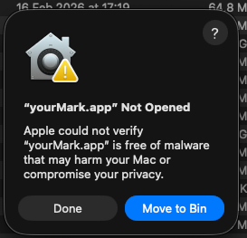
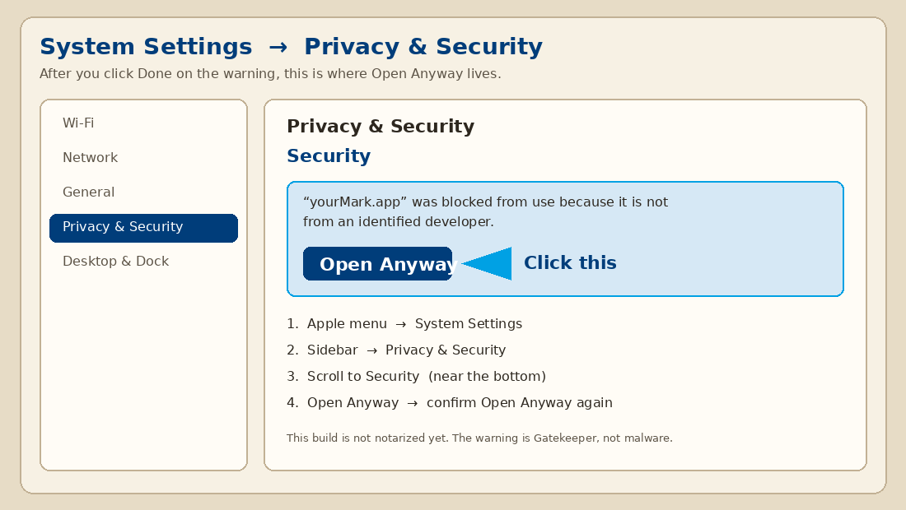

# Install yourMark

## Double-click (recommended)

1. Download [yourMark-0.3.31.dmg](https://github.com/Burbank/yourMark/releases/latest/download/yourMark-0.3.31.dmg) (the filename includes the version).
2. Open the disk image and **drag yourMark onto Applications** (follow the arrow). Then open yourMark from Applications.

### If macOS says it “could not verify” the app

That dialog is Gatekeeper. This build is not notarized yet, so Apple cannot vouch for it. It is expected.

<p align="center">
  
</p>

1. Click **Done** — not **Move to Bin**.
2. Apple menu → **System Settings**.
3. Sidebar → **Privacy & Security**.
4. Scroll to **Security** (near the bottom).
5. Click **Open Anyway** next to *“yourMark.app” was blocked to protect your Mac*.
6. Confirm **Open Anyway**.

The disk image has **If Apple blocks it** — that is a help page in Safari (not a program, and it does not need the internet). It can open System Settings for you.

<p align="center">
  
</p>

Or: right-click yourMark → **Open**.

Then open yourMark. The first launch **installs Microsoft MarkItDown itself** (official PyPI package — not a copy inside the app). Needs the internet once.

macOS 14 or newer.

## Homebrew (optional)

```sh
brew tap Burbank/yourMark
brew install --cask yourmark
```

First launch still installs MarkItDown if it is missing.

## Terminal

```sh
git clone https://github.com/Burbank/yourMark.git
cd yourMark
chmod +x Scripts/Install.command
./Scripts/Install.command
```

The app installs MarkItDown on first launch. To do that step yourself:

```sh
curl -LsSf https://astral.sh/uv/install.sh | sh
uv tool install 'markitdown[all]'
```

## Uninstall

```sh
rm -rf /Applications/yourMark.app
rm -rf ~/Library/Application\ Support/yourMark
uv tool uninstall markitdown   # optional — only if you do not need MarkItDown elsewhere
```

## Site

Use the same program in the browser: [burbank.github.io/yourMark](https://burbank.github.io/yourMark/)
