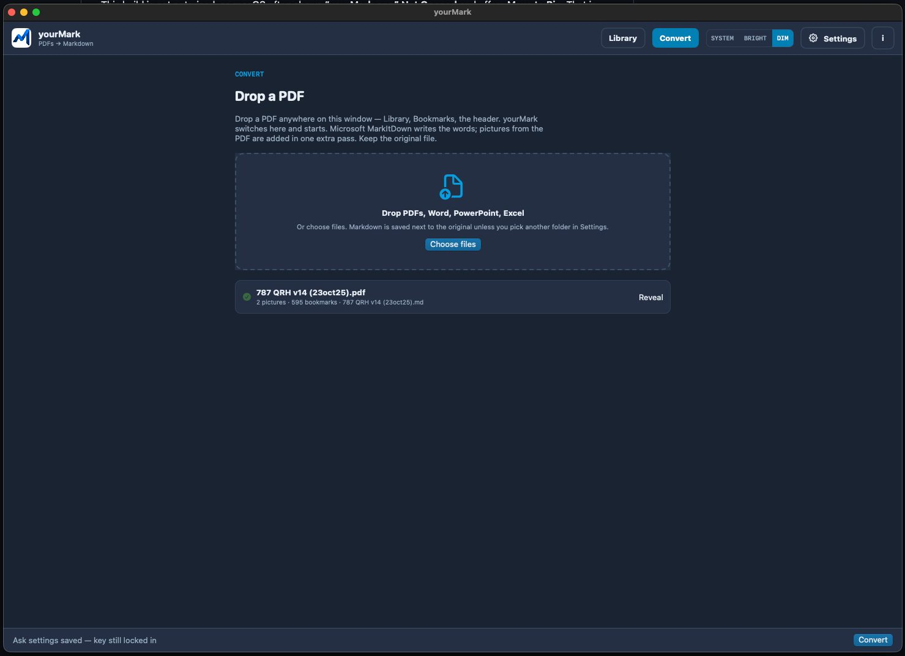

# yourMark

<p align="center">
  
</p>

Native **macOS** SwiftUI wrapper around [Microsoft MarkItDown](https://github.com/microsoft/markitdown). Convert PDFs, Word, PowerPoint, Excel, pictures, and ZIP archives to Markdown **on this Mac**.

**[Download yourMark-0.3.31.dmg](https://github.com/Burbank/yourMark/releases/latest/download/yourMark-0.3.31.dmg)** · [All releases](https://github.com/Burbank/yourMark/releases) · [Install notes](INSTALL.md) · [Use it in the browser](https://burbank.github.io/yourMark/)

## Why Markdown

A PDF is a picture of a page. Markdown is the words, in order, as plain text you can search and edit.

That is why it works so well with AI. A model can read a chapter, quote it, and tell you when the file is silent — instead of guessing at columns or a scan. Paste one heading into Grok or ChatGPT, keep notes in Obsidian, or search a whole course. Tables stay tables. Headings stay an outline.

Keep the original PDF. Markdown is the working copy.

## A look around — pick your rooms and your look

yourMark is a Mac window, not a terminal. Three rooms, three looks. If this already feels like something you would open, it is probably for you.

**Rooms**

- **Convert** — drop a PDF, Word, slides, or Excel. Microsoft MarkItDown writes the words on this computer.
- **Library** — file on the left, bookmarks in the middle, Markdown on the right. Ask a chapter at the bottom with your own key.
- **Settings** — lock a Grok or OpenAI key once. Extra tools for scans (Docling) are optional.

**Looks** — **Bright** (paper), **Dim** (a night desk), or **System** (follow macOS). Switch any time in the header.

<p align="center">
  
</p>

<p align="center"><strong>Library · Dim</strong> — the window you live in. File, bookmarks, Markdown. Ask a chapter underneath. Bookmarks jump like Preview.</p>

<table>
<tr>
<td width="25%" valign="top">

<p><strong>Library · Bright</strong> — same three columns on paper.</p>
</td>
<td width="25%" valign="top">

<p><strong>Convert · Dim</strong> — drop a PDF. Conversion stays on this Mac.</p>
</td>
<td width="25%" valign="top">

<p><strong>Convert · Bright</strong> — this 787 handbook kept 595 bookmarks from the PDF itself.</p>
</td>
<td width="25%" valign="top">

<p><strong>Settings</strong> — paste a key, press Enter, it is tested and locked. Docling is only for scans.</p>
</td>
</tr>
</table>

The GUI never vendors the converter. It finds `markitdown` on this Mac; **Upgrade Engine** pulls the current PyPI release.

**Requires:** macOS 14+. Open the disk image and **drag yourMark onto Applications** (follow the arrow). Do not keep working from the disk — if you do, yourMark will offer to copy itself into Applications so ejecting the disk is safe. First launch installs Microsoft MarkItDown from PyPI if it is missing. Building from source needs Xcode.

If macOS says it could not verify the app: click **Done** (not Move to Bin), then open **If Apple blocks it** on the disk (a help page in Safari, not a program), or right-click yourMark → Open. That warning is Gatekeeper (not notarized yet) — not malware.

---

## What conversion actually keeps

| You asked | Honest result |
|-----------|----------------|
| **Tables** | Yes when the PDF has a real table (GFM). Colours / merged cells flatten. |
| **Pictures** | Every embedded photo, plus a drawing of diagram pages that have no photo, linked next to that page in the Markdown. Word/PPTX/photos use MarkItDown’s own images. Not the original x/y layout. Convert puts the Markdown and a `figures` folder together in a little folder named after the file. |
| **Headers / footers** | **Remove headers and footers** in Settings (on by default) drops repeating page titles, page numbers, dates, and header logos. Chapter headings like 8.1 stay. |
| **Outline** | The PDF’s own bookmarks (same tree as Preview.app) are written in as Markdown headings. Numbered titles (8.1, 8.1.1) become headings too. MarkItDown does not emit them. |
| **Other files** | Word, PowerPoint, Excel, HTML, EPUB, CSV, JSON, XML, Outlook mail, RTF, ZIP (each file inside), and photos (JPEG/PNG/GIF/WebP, with EXIF when ExifTool is installed). |

---

## Install

**Everyone:** download the DMG, drag **yourMark** onto **Applications** (follow the arrow), then open it. First launch installs Microsoft MarkItDown.

**Homebrew (optional):**

```sh
brew tap Burbank/yourMark
brew install --cask yourmark
uv tool install 'markitdown[all]'
```

**From source:** `./Scripts/Install.command` or `./Scripts/build-app.sh`

---

### If Apple blocks the app

This build is not notarized, so macOS often shows **“yourMark.app” Not Opened** and offers **Move to Bin**. That is Gatekeeper, not malware.

<p align="center">
  
</p>

1. Click **Done** — not **Move to Bin**.
2. Apple menu → **System Settings**.
3. Sidebar → **Privacy & Security**.
4. Scroll to **Security** (near the bottom of that pane).
5. Next to *“yourMark.app” was blocked to protect your Mac*, click **Open Anyway**.
6. Confirm **Open Anyway** on the next dialog.

<p align="center">
  
</p>

You can also right-click yourMark → **Open**, or open **If Apple blocks it** on the disk image (a help page in Safari with a button into System Settings).

## License

MIT wrapper. MarkItDown is MIT from Microsoft.
