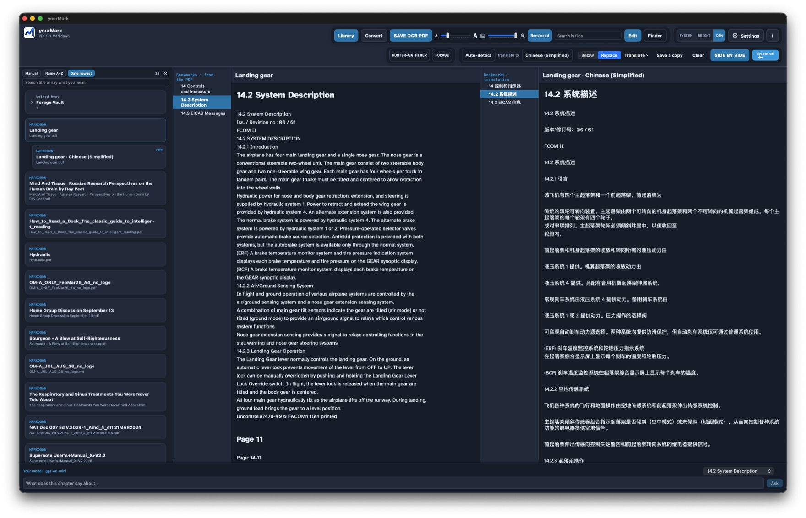
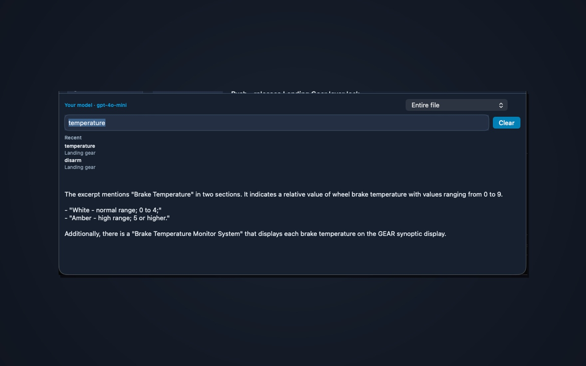

# yourMark

<p align="center">
  
</p>

A Mac app that turns PDFs — and Word, slides, or a spreadsheet — into **Markdown**. That is ordinary text you can search, copy, ask about, translate, and share with an AI. The file never leaves this computer unless you press Ask or Translate.

**[Download yourMark-0.5.1.dmg](https://github.com/Burbank/yourMark/releases/latest/download/yourMark-0.5.1.dmg)** · [All versions](https://github.com/Burbank/yourMark/releases) · [Install notes](INSTALL.md)

[Test a simpler version in your browser](https://burbank.github.io/yourMark/) (preview only — no OCR)

The GitHub disk is named **yourMark**. The Mac App Store listing is **yourMark AI** (the short name was taken). Same app, two channels.

## Why Markdown?

A PDF is a picture of a page. Markdown is the words, in order.

That is why it works so well with AI. A model can read a chapter and quote the words that are there. If that chapter does not have the answer, it can say so — instead of guessing at a scan. Paste a heading into Grok or ChatGPT, keep notes, or search a whole course. Tables stay tables. Headings stay an outline.

Keep the original PDF. Markdown is the working copy.

## A look inside

- **Convert** — drop a PDF, Word, slides, or Excel. The words are written on your Mac, not online. A `.md` you already have skips the converter: File → Open, drop it, or put it in the folder you chose.
- **Library** — file on the left, bookmarks in the middle, the text on the right. Search in files stays on this Mac. Ask a chapter at the bottom if you add a key.
- **Translate** — From and To in the reader. A Google Translate key or an Ask AI key is enough; you do not need both. Below keeps the original; Replace shows only the translation. **SIDE BY SIDE** opens both languages and they can scroll together.
- **Hunter-Gatherer / FORAGE** — select text, press Enter, keep clips on a dated note beside the reader.
- **Settings** — choose the folder once (iCloud if you want). New Markdown in that folder appears in the library. Bright, Dim, or System in the header; your keys; extra help for scanned pages.

yourMark is the window. [Microsoft MarkItDown](https://github.com/microsoft/markitdown) does the converting, on this Mac. If Microsoft publishes an update, yourMark can install it for you.

Needs **macOS 14** or later. Open the disk and **drag yourMark onto Applications** (follow the arrow). Do not keep working from the disk — if you do, yourMark will copy itself into Applications so ejecting is safe. The first launch installs MarkItDown if it is missing. The first window asks where converted files should live.

This Mac disk is signed and notarized by Apple. Open yourMark from Applications.

[Privacy](https://burbank.github.io/yourMark/privacy.html) · [Apple distribution](docs/apple-distribution.md) (notarized GitHub disk and Mac App Store)

## Pictures of the window

<br>


<br>

Library at night — files, bookmarks, and the text. Pictures are blue links; hover to see them. Ask a chapter underneath.

<br>

|  |  |  |
| --- | --- | --- |
| Library · Bright — three columns on paper. | Convert — drop a PDF. Nothing is uploaded. | Settings — folder, colours, MarkEdit, and your keys. |

<br>


<br>

Pictures are blue links, not the photo in the page. Hover over a link to see it. Use the slider to adjust the preview size.

<br>

## Translate

<br>



<br>

Lock a **Google Translate** key or an **Ask AI** key in Settings — either one shows the translate buttons. Pick **From** and **To**. **Below** keeps the original under each paragraph. **Replace** shows only the translation. This chapter is the cheap way; Entire file sends more text.

**SIDE BY SIDE** opens the pair. **SyncScroll** keeps the headings together. Save a copy writes a second file (for example `Manual.es.md`). The original Markdown is not overwritten. Convert still stays on this Mac. Google Translate is incredibly fast.

<br>

## Ask

<br>



<br>

Paste a Grok or OpenAI key in Settings. Ask the open chapter, or the start of the file. AND, OR, and NOT must be capitals, and the words must sit in the same sentence or paragraph. Recent Asks stay on this Mac.

Search in files is separate — it finds words on every library card and is never sent to the AI.

<br>

## Changing the text

yourMark is a **reader**. To change the file, press **Edit**. That opens [MarkEdit](https://github.com/MarkEdit-app/MarkEdit), a free Mac editor. Get it from Settings if it is not installed. You do not need a GitHub account. Saves in MarkEdit show up here.

<br>


<br>

yourMark on the left. MarkEdit on the right. Press Edit; what you save there shows up here.

**Show in Finder** highlights the little folder when there are pictures (Markdown plus `figures`). Right-click that folder, compress it, and send the zip to your favourite AI. If there are no pictures, it highlights the `.md`.

<br>

## What you get

| You asked | What you actually get |
|-----------|------------------------|
| **Tables** | Yes, when the PDF has a real table. Colours and merged cells become plain cells. |
| **Pictures** | The photos that were inside the PDF, next to that page. We do not add photographs of whole text pages. The Markdown and a `figures` folder sit together in a little folder named after the file. |
| **Headers / footers** | **Remove headers and footers** in Settings (on by default) drops repeating page titles, page numbers, dates, and header logos. Chapter titles like 8.1 stay. |
| **Bookmarks** | The same outline Preview shows becomes headings in the Markdown. Numbered titles (8.1, 8.1.1) become headings too. |
| **Other files** | Word, PowerPoint, Excel, web pages, EPUB, CSV, mail, RTF, ZIP (each file inside), and photos. Ready `.md` files skip the converter. |

## Install

### Mac version, most complete

Download the disk image, drag **yourMark** onto **Applications** (follow the arrow), then open it. First launch installs Microsoft MarkItDown. Then choose a folder for converted files — this Mac, iCloud, or anywhere you like.

<p align="center">
  
</p>

The first open may show this. That is normal. Click **Open**. The dim line is Apple saying it already scanned the disk — yourMark is notarized.

**Homebrew (optional):**

```sh
brew tap Burbank/yourMark
brew install --cask yourmark
```

**From source:** `./Scripts/Install.command`

### Windows (early)

[Download yourMark.exe](https://github.com/Burbank/yourMark/releases/latest/download/yourMark.exe). No library, bookmarks, or Ask. Same Microsoft converter.

1. Double-click **yourMark.exe**. You do not need Python.
2. If Windows says **Windows protected your PC**, click **More info** → **Run anyway**.
3. Choose a PDF (or Word, slides, Excel), then **Convert**. A folder opens with the Markdown.
4. To edit, use [MarkText](https://github.com/marktext/marktext) (free, open source). MarkEdit is Mac-only. The exe has a **Get MarkText** button.

More in [`windows/`](windows/README.md).

## License

yourMark is MIT. MarkItDown is MIT, from Microsoft. Not an official Microsoft product.
