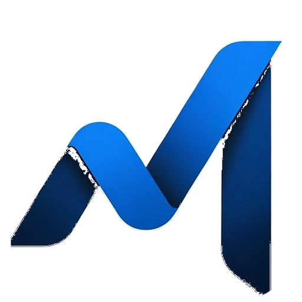
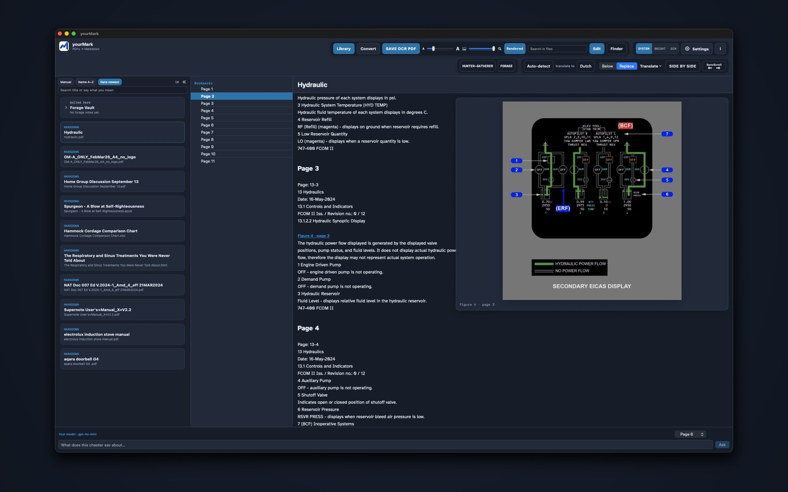
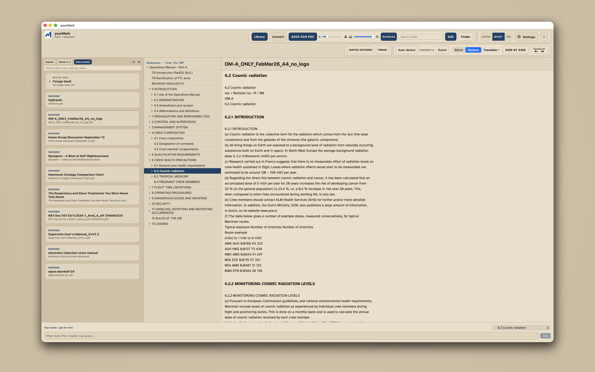
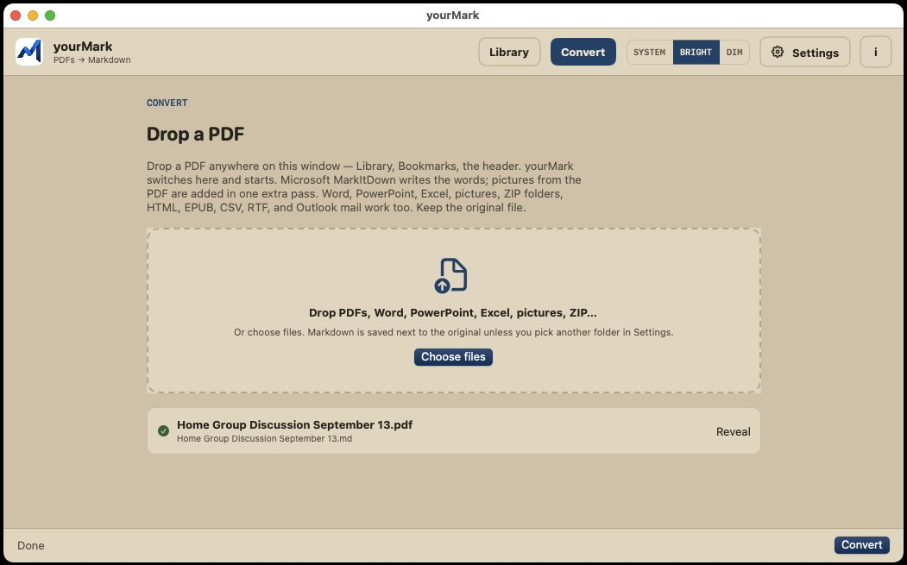
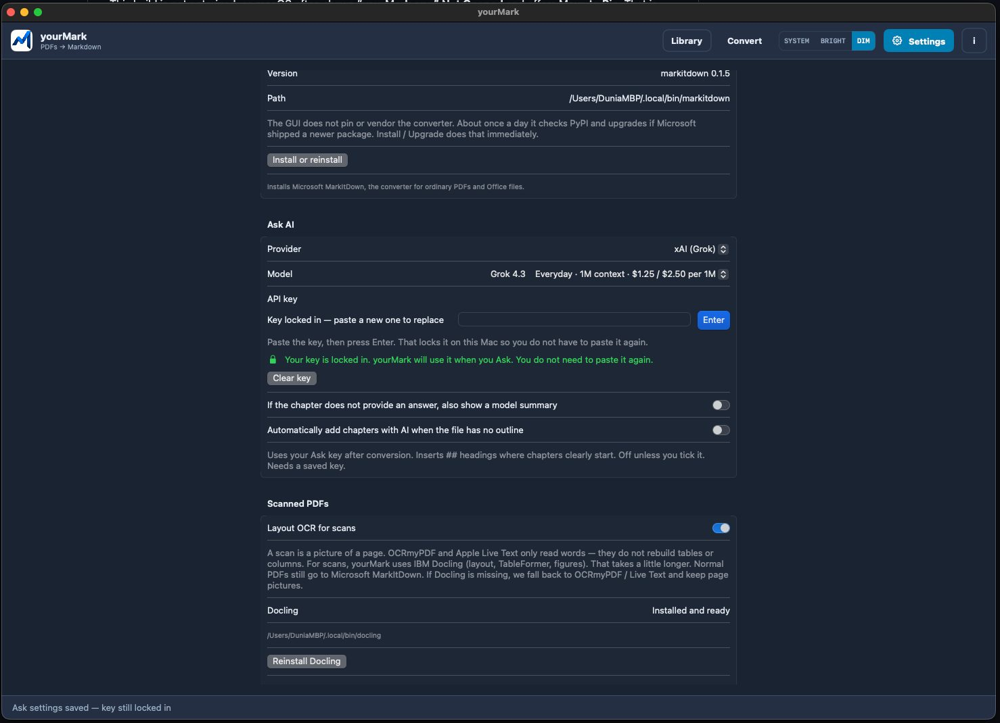
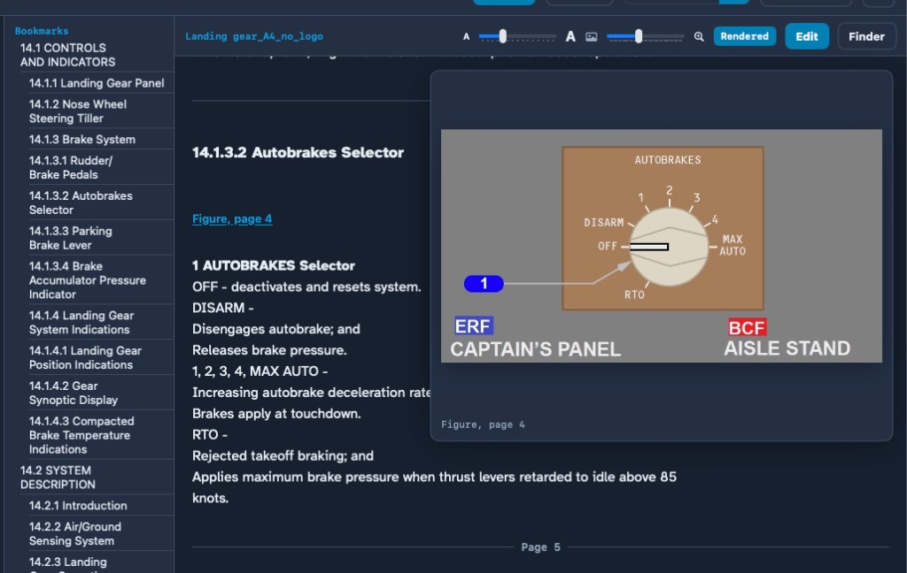
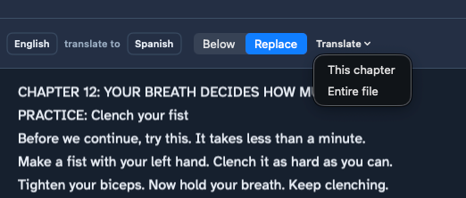
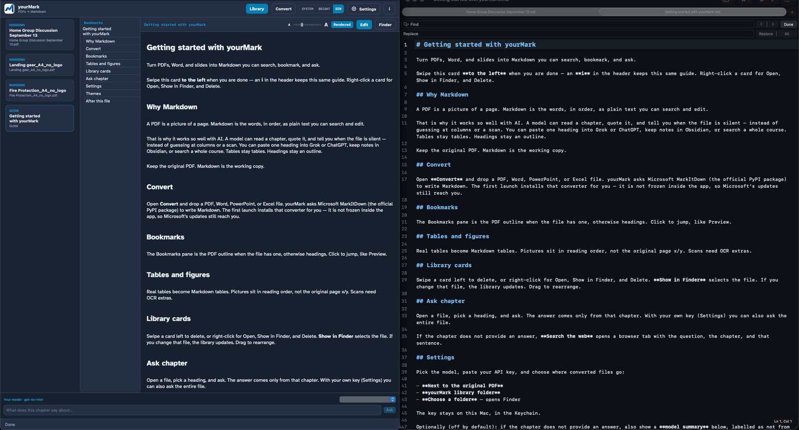
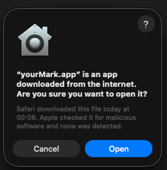

# yourMark

<p align="center">
  
</p>

A Mac app that turns PDFs — and Word, slides, or a spreadsheet — into **Markdown**. That is ordinary text you can search, copy, and ask questions about. The file never leaves this computer. See [All versions](https://github.com/Burbank/yourMark/releases) for an early Windows version as well.

**[Download yourMark-0.5.0.dmg](https://github.com/Burbank/yourMark/releases/latest/download/yourMark-0.5.0.dmg)** · [All versions](https://github.com/Burbank/yourMark/releases) · [Install notes](INSTALL.md)

[Test a simpler version in your browser](https://burbank.github.io/yourMark/) (preview only — no OCR)

## Why Markdown?

A PDF is a picture of a page. Markdown is the words, in order.

That is why it works so well with AI. A model can read a chapter and quote the words that are there. If that chapter does not have the answer, it can say so — instead of guessing at a scan. Paste a heading into Grok or ChatGPT, keep notes, or search a whole course. Tables stay tables. Headings stay an outline.

Keep the original PDF. Markdown is the working copy.

## A look inside

The window has three places:

- **Convert** — drop a PDF, Word, slides, or Excel. The words are written on your Mac, not online.
- **Library** — file on the left, bookmarks in the middle, the text on the right. Ask a chapter at the bottom if you add a key. Translate sits in the reader toolbar.
- **Settings** — Bright, Dim, or System colours in the header; an optional AI key or Google Translate key; extra help for scanned pages.

yourMark is the window. [Microsoft MarkItDown](https://github.com/microsoft/markitdown) does the converting, on this Mac. If Microsoft publishes an update, yourMark can install it for you.

Needs **macOS 14** or later. Open the disk and **drag yourMark onto Applications** (follow the arrow). Do not keep working from the disk — if you do, yourMark will copy itself into Applications so ejecting is safe. The first launch installs MarkItDown if it is missing.

This Mac disk is signed and notarized by Apple. Open yourMark from Applications.

[Privacy](https://burbank.github.io/yourMark/privacy.html) · [Apple distribution](docs/apple-distribution.md) (notarized GitHub disk and Mac App Store)

## Pictures of the window

<br>



<br>

Library at night — files, bookmarks, and the text. Ask a chapter underneath. Bookmarks jump like Preview.

<br>

|  |  |  |
| --- | --- | --- |
| Library · Bright — the same three columns on paper. | Convert — drop a PDF. Nothing is uploaded. | Settings — headers, font, MarkEdit, and your key. |

<br>



<br>

Pictures are blue links, not the photo in the page. Hover over a link to see it. Use the slider to adjust the preview size.

<br>

## Translate

<br>



<br>

Pick **From** and **To** in the reader. **Below** keeps the original and puts the translation under each paragraph. **Replace** shows only the translation. Translate this chapter, or the entire file.

Save a copy writes a second Markdown file next to the original (for example `Manual.es.md`). The original words are not overwritten. Convert still stays on this Mac. The chapter is sent to Google Translate or to your Ask key — pick which in Settings. Google Translate is incredibly fast.

<br>

## Changing the text

yourMark is a **reader**. To change the file, press **Edit**. That opens [MarkEdit](https://github.com/MarkEdit-app/MarkEdit), a free Mac editor. Get it from Settings if it is not installed. You do not need a GitHub account. Saves in MarkEdit show up here.

<br>



<br>

yourMark on the left. MarkEdit on the right. Press Edit; what you save there shows up here.

When you are happy with it, right-click the folder that holds the Markdown and the pictures, compress it, and send that zip to your favourite AI.

<br>

## What you get

| You asked | What you actually get |
|-----------|------------------------|
| **Tables** | Yes, when the PDF has a real table. Colours and merged cells become plain cells. |
| **Pictures** | The photos that were inside the PDF, next to that page. We do not add photographs of whole text pages. The Markdown and a `figures` folder sit together in a little folder named after the file. |
| **Headers / footers** | **Remove headers and footers** in Settings (on by default) drops repeating page titles, page numbers, dates, and header logos. Chapter titles like 8.1 stay. |
| **Bookmarks** | The same outline Preview shows becomes headings in the Markdown. Numbered titles (8.1, 8.1.1) become headings too. |
| **Other files** | Word, PowerPoint, Excel, web pages, EPUB, CSV, mail, RTF, ZIP (each file inside), and photos. |

## Install

### Mac version, most complete

Download the disk image, drag **yourMark** onto **Applications** (follow the arrow), then open it. First launch installs Microsoft MarkItDown.

<p align="center">
  
</p>

The first open may show this. That is normal. Click **Open**. The dim line is Apple saying it already scanned the disk — yourMark is notarized.

**Homebrew (optional):**

```sh
brew tap Burbank/yourMark
brew install --cask yourmark
```

**From source:** `./Scripts/Install.command`

### Windows (early)

[Download yourMark.exe](https://github.com/Burbank/yourMark/releases/latest/download/yourMark.exe). No library, bookmarks, or Ask. Same Microsoft converter.

1. Double-click **yourMark.exe**. You do not need Python.
2. If Windows says **Windows protected your PC**, click **More info** → **Run anyway**.
3. Choose a PDF (or Word, slides, Excel), then **Convert**. A folder opens with the Markdown.
4. To edit, use [MarkText](https://github.com/marktext/marktext) (free, open source). MarkEdit is Mac-only. The exe has a **Get MarkText** button.

More in [`windows/`](windows/README.md).

## License

yourMark is MIT. MarkItDown is MIT, from Microsoft. Not an official Microsoft product.
