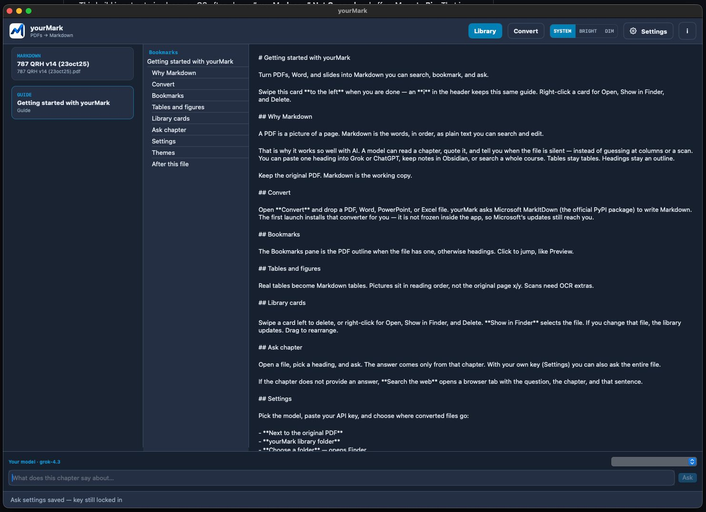
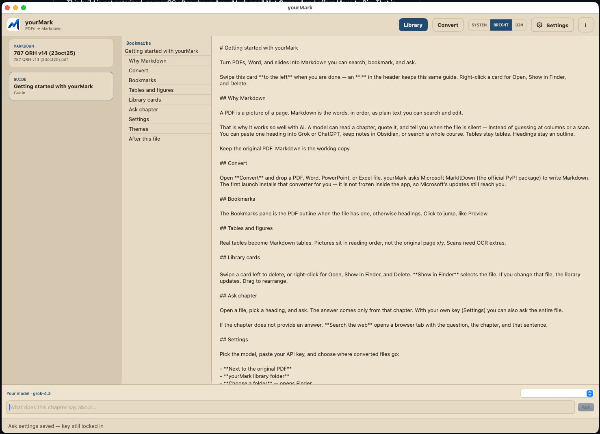

# yourMark

<p align="center">
  
</p>

A Mac app that turns PDFs — and Word, slides, or a spreadsheet — into **Markdown**. That is ordinary text you can search, copy, and ask questions about. The file never leaves this computer. See [All versions](https://github.com/Burbank/yourMark/releases) for an early Windows version as well.

**[Download yourMark-0.3.40.dmg](https://github.com/Burbank/yourMark/releases/latest/download/yourMark-0.3.40.dmg)** · [All versions](https://github.com/Burbank/yourMark/releases) · [Install notes](INSTALL.md) · [Test a simpler version in your browser](https://burbank.github.io/yourMark/)

## Why Markdown?

A PDF is a picture of a page. Markdown is the words, in order.

That is why it works so well with AI. A model can read a chapter, quote it, and say when the file is silent — instead of guessing at a scan. Paste a heading into Grok or ChatGPT, keep notes, or search a whole course. Tables stay tables. Headings stay an outline.

Keep the original PDF. Markdown is the working copy.

## A look inside

The window has three places:

- **Convert** — drop a PDF, Word, slides, or Excel. The words are written on this Mac.
- **Library** — file on the left, bookmarks in the middle, the text on the right. Ask a chapter at the bottom if you add a key.
- **Settings** — Bright, Dim, or System colours in the header; an optional AI key; extra help for scanned pages.

yourMark is the window. [Microsoft MarkItDown](https://github.com/microsoft/markitdown) does the converting, on this Mac. If Microsoft publishes an update, yourMark can install it for you.

Needs **macOS 14** or later. Open the disk and **drag yourMark onto Applications** (follow the arrow). Do not keep working from the disk — if you do, yourMark will copy itself into Applications so ejecting is safe. The first launch installs MarkItDown if it is missing.

If Apple says it could not verify the app: click **Done** (not Move to Bin), then open **If Apple blocks it** on the disk — a help page in Safari, not a program — or right-click yourMark → Open. That warning is normal until the app is notarized. It is not malware.

## Pictures of the window

<br>



<br>

Library at night — files, bookmarks, and the text. Ask a chapter underneath. Bookmarks jump like Preview.

<br>

|  |  |  |
| --- | --- | --- |
| Library · Bright — the same three columns on paper. | Convert — drop a PDF. Nothing is uploaded. | Settings — headers, font, MarkEdit, and your key. |

<br>

## Changing the text

yourMark is a **reader**. To change the file, press **Edit**. That opens [MarkEdit](https://github.com/MarkEdit-app/MarkEdit), a free Mac editor. Get it from Settings if it is not installed. You do not need a GitHub account. Saves in MarkEdit show up here.

<br>


<br>

yourMark on the left. MarkEdit on the right. Press Edit; what you save there shows up here.

<br>

## What you get

| You asked | What you actually get |
|-----------|------------------------|
| **Tables** | Yes, when the PDF has a real table. Colours and merged cells become plain cells. |
| **Pictures** | The photos that were inside the PDF, next to that page. We do not add photographs of whole text pages. The Markdown and a `figures` folder sit together in a little folder named after the file. |
| **Headers / footers** | **Remove headers and footers** in Settings (on by default) drops repeating page titles, page numbers, dates, and header logos. Chapter titles like 8.1 stay. |
| **Bookmarks** | The same outline Preview shows becomes headings in the Markdown. Numbered titles (8.1, 8.1.1) become headings too. |
| **Other files** | Word, PowerPoint, Excel, web pages, EPUB, CSV, mail, RTF, ZIP (each file inside), and photos. |

## Install

### Mac version, most complete

Download the disk image, drag **yourMark** onto **Applications** (follow the arrow), then open it. First launch installs Microsoft MarkItDown.

**Homebrew (optional):**

```sh
brew tap Burbank/yourMark
brew install --cask yourmark
```

**From source:** `./Scripts/Install.command`

### Windows (early)

[Download yourMark.exe](https://github.com/Burbank/yourMark/releases/latest/download/yourMark.exe). No library, bookmarks, or Ask. Same Microsoft converter.

1. Double-click **yourMark.exe**. You do not need Python.
2. If Windows says **Windows protected your PC**, click **More info** → **Run anyway**.
3. Choose a PDF (or Word, slides, Excel), then **Convert**. A folder opens with the Markdown.
4. To edit, use [MarkText](https://github.com/marktext/marktext) (free, open source). MarkEdit is Mac-only. The exe has a **Get MarkText** button.

More in [`windows/`](windows/README.md).


### If Apple blocks the app

This build is not notarized yet, so macOS often shows **“yourMark.app” Not Opened** and offers **Move to Bin**. That is Apple being careful — not a virus.


1. Click **Done** — not **Move to Bin**.
2. Apple menu → **System Settings**.
3. Sidebar → **Privacy & Security**.
4. Scroll to **Security**.
5. Next to *“yourMark.app” was blocked to protect your Mac*, click **Open Anyway**.
6. Confirm **Open Anyway**.


You can also right-click yourMark → **Open**, or open **If Apple blocks it** on the disk (a page in Safari with a button into Settings).

## License

yourMark is MIT. MarkItDown is MIT, from Microsoft. Not an official Microsoft product.
