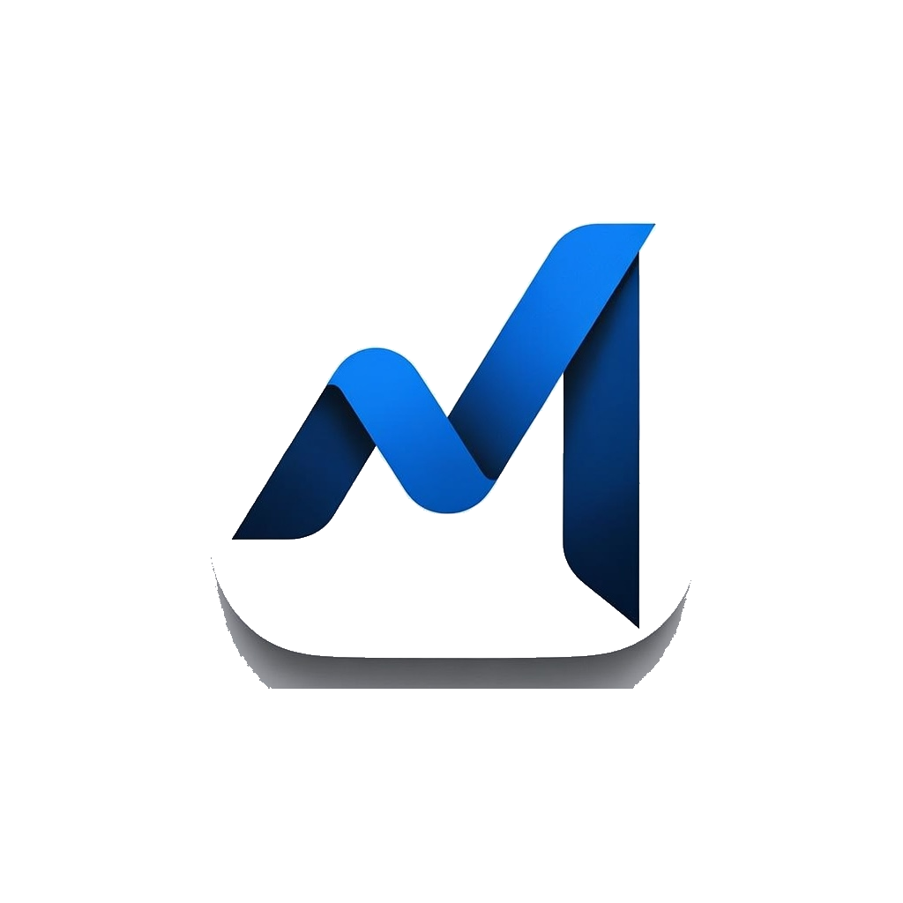

# yourMark

<p align="center">
  
</p>

Native **macOS** SwiftUI wrapper around [Microsoft MarkItDown](https://github.com/microsoft/markitdown). Convert PDFs, Word, PowerPoint, and Excel to Markdown **on this Mac**.

**[Download for Mac](https://github.com/Burbank/yourMark/releases/latest/download/yourMark.dmg)** · [Install notes](INSTALL.md) · [Use it in the browser](https://burbank.github.io/yourMark/)

## Why Markdown

A PDF is a picture of a page. Markdown is the words, in order, as plain text you can search and edit.

That is why it works so well with AI. A model can read a chapter, quote it, and tell you when the file is silent — instead of guessing at columns or a scan. Paste one heading into Grok or ChatGPT, keep notes in Obsidian, or search a whole course. Tables stay tables. Headings stay an outline.

Keep the original PDF. Markdown is the working copy.

The GUI never vendors the converter. It finds `markitdown` on this Mac; **Upgrade Engine** pulls the current PyPI release.

**Requires:** macOS 14+. First launch installs Microsoft MarkItDown from PyPI if it is missing. Building from source needs Xcode.

If macOS blocks the download: right-click → Open, or run **If macOS blocks yourMark** on the disk image. The warning is Gatekeeper (not notarized yet) — not malware.

---

## What conversion actually keeps

| You asked | Honest result |
|-----------|----------------|
| **Tables** | Yes when the PDF has a real table (GFM). Colours / merged cells flatten. |
| **Pictures** | Reading order, not page x/y. Word/PPTX usually include them. |
| **Outline** | PDF bookmarks + Markdown headings. Click to jump. |

---

## Install

**Everyone:** download the DMG, drag the app to Applications, double-click **Install Engine**.

**Homebrew (optional):**

```sh
brew tap Burbank/yourMark
brew install --cask yourmark
uv tool install 'markitdown[all]'
```

**From source:** `./Scripts/Install.command` or `./Scripts/build-app.sh`

## License

MIT wrapper. MarkItDown is MIT from Microsoft.
